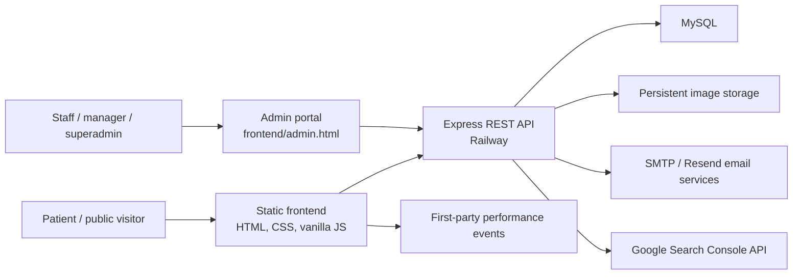

# Architecture

_Baseline: `main` at `d07b077`, reviewed 2026-08-13._

## System Context

The public frontend and admin portal are static browser applications. They call the same REST API. The backend owns validation, authorization, database access, email, uploads, and performance reporting.

## Repository Map

| Path | Responsibility |
|---|---|
| `frontend/*.html` | Public, authentication, and admin entry pages |
| `frontend/js/main.js` | Shared public navigation/header/footer behavior and dynamic service navigation |
| `frontend/js/api.js` | Shared API base selection, request wrapper, and public/authenticated clients |
| `frontend/admin.js` | Current production admin dashboard bundle |
| `frontend/js/admin.js` | Older unused admin implementation; audit before removal |
| `frontend/css/` | Page and shared styles; `admin-upgrades.css` is the largest admin override layer |
| `frontend/images/` | Static brand/media assets plus locally stored upload content |
| `backend/server.js` | Express application composition, middleware, route mounting, static images, health check, and startup |
| `backend/db.js` | MySQL pool, production-required settings, and optional TLS |
| `backend/middleware/` | JWT, active-account, and role enforcement |
| `backend/routes/` | Public and protected API route families |
| `backend/services/` | Email and Google Search Console integrations |
| `backend/config/uploadStorage.js` | Persistent/local upload-root selection |
| `backend/schema.sql` | Legacy base schema and seed data; not a complete current production baseline |
| `database/` | Incremental operational migrations |
| `backend/migrations/` | Services V2 and community activity migrations |
| `scripts/check-project.js` | Dependency-free repository checks |

## Frontend

The frontend is a static multi-page application, not a bundled SPA. Most public pages load `frontend/js/main.js`. Pages that need data also load `frontend/js/api.js` and a page-specific script.

The API base is selected at runtime:

- localhost/127.0.0.1 uses `http://localhost:4000/api`;
- other hosts use the Railway production API;
- `window.KP_API_BASE` can override both before `api.js` loads.

Important consequences:

- local frontend origin must be included in backend CORS settings;
- production API URL changes require a coordinated frontend update or injected override;
- static asset changes may need cache-version updates in HTML;
- DOM rendering must escape database/user content before using HTML sinks.

### Admin portal

`frontend/admin.html` loads:

1. `frontend/js/api.js`;
2. Chart.js from jsDelivr;
3. SheetJS from its CDN;
4. `frontend/admin.js`.

The admin bundle stores its JWT in `sessionStorage` and exposes modules based on a browser-side role map. Server middleware remains the real authorization boundary.

## Backend

The backend targets Node.js 24.x and Express 4. `backend/server.js` applies:

- Helmet;
- an explicit CORS allowlist;
- 2 MB JSON/form limits;
- `Cache-Control: no-store` on API responses;
- a general API rate limit;
- a database-backed health check;
- generic 404 and 500 responses.

Route families mounted below `/api`:

- `auth` and signup/account verification;
- `admin-users`;
- `uploads`;
- `doctors`;
- service categories, subcategories, catalog, and services;
- first-party performance and Google Search performance;
- bookings;
- feedback;
- branches, promotions, and activities (mounted by the optional-route helper when files exist).

The database-driven public service sitemap is mounted outside `/api` at
`/sitemap-services.xml`. It contains canonical service-detail URLs for active
services whose category and subcategory are also active, and uses a short
public cache rather than the API-wide `no-store` policy.

### Authentication and roles

Login issues a JWT with the administrator ID, username, and role. The default lifetime is eight hours. Protected routes should compose:

1. `requireAdmin` to verify the token;
2. `requireActiveAdmin` to reload the account and reject disabled/non-active accounts;
3. a role-specific middleware.

Current roles:

| Role | Intended access |
|---|---|
| `admin` | Bookings and performance |
| `manager` | Admin access plus content/operational management |
| `superadmin` | Manager access plus user approval and role management |

## Data and Storage

Core data areas include branches, doctors, services, service taxonomy, service prices/gallery, bookings, feedback, administrators/password resets, promotions, community activities/gallery, and website performance events.

The schema history is not yet canonical:

- `backend/schema.sql` creates the original tables and an `admin_users` table;
- current authentication code queries `admins`;
- `database/01_upgrade_schema.sql` creates/extends `admins` and other V2 tables;
- later SQL is split between `database/` and `backend/migrations/`;
- `database/07_booking_gender_identity.sql` hardcodes `USE railway` and is not idempotent.

This prevents a safe claim that a fresh database can be recreated by one documented command. Establishing a versioned baseline and migration runner is the first roadmap item.

Uploads use a Railway volume or `UPLOAD_DIR` in production. Local development writes to `frontend/images/uploads`. Database records store relative URLs. Uploaded files therefore require a backup strategy separate from MySQL backups.

## Deployment

Documented/current signals indicate:

- public domain: `https://klinikputrijaya.com`;
- backend: Railway;
- database: MySQL;
- frontend: documented as Cloudflare Pages, while Firebase configuration remains in the repository.

The frontend hosting source of truth must be confirmed before cleanup or deployment automation. Do not remove Firebase files or change DNS/deployment settings based only on this document.

## Architectural Risks to Address

1. No canonical database baseline or automated migration history.
2. No automated unit/integration/end-to-end tests.
3. Production admin behavior is concentrated in a roughly 13,000-line file.
4. A legacy admin implementation and duplicated/stale assets remain tracked.
5. Many DOM HTML sinks require a deliberate XSS audit.
6. The upload route checks declared MIME type but still needs content-signature validation and active-account authorization review.
7. Static image middleware is mounted twice in `server.js`, including once before Helmet.
8. Frontend deployment configuration is ambiguous between documented Cloudflare Pages and checked-in Firebase files.

See `docs/BASELINE_AUDIT.md` and `ROADMAP.md` for evidence and ordering.
